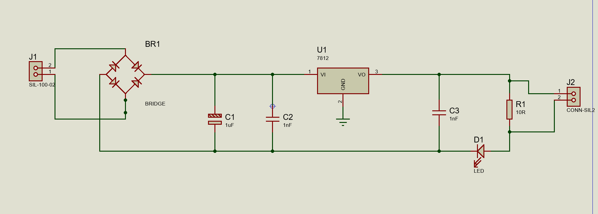
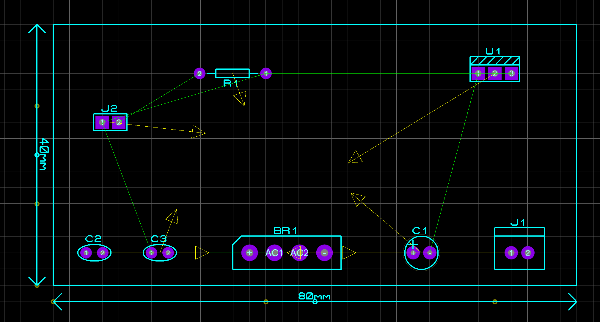
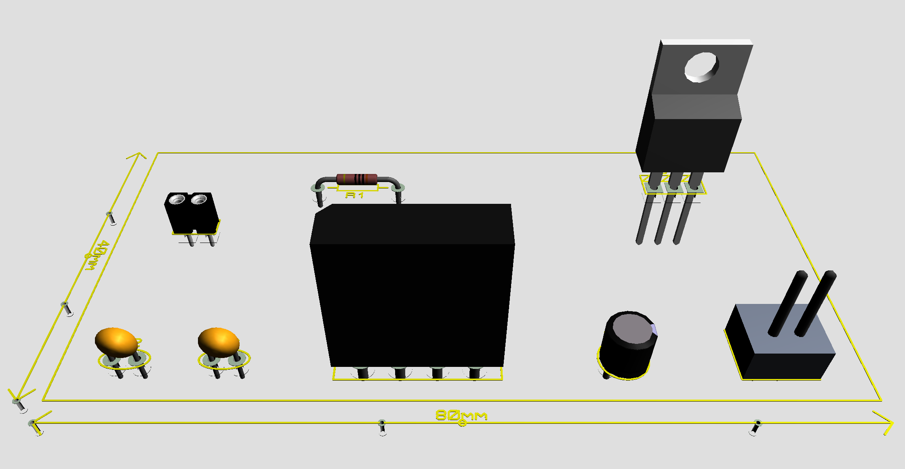

# Protótipo de Carregador

Este projeto consiste em um protótipo de fonte linear regulada de 12V, projetado para converter tensão AC em uma saída DC estável utilizando retificação em ponte, filtragem capacitiva e regulação com o 7812.

O circuito foi projetado e simulado utilizando ferramentas de EDA (Electronic Design Automation), incluindo o desenvolvimento do esquemático, layout da PCB e visualização 3D.

---

## Preview do Projeto

| Esquemático | Layout da PCB | Visualização 3D |
|:-----------:|:-------------:|:---------------:|
|  |  |  |

---

## Funcionamento do Circuito

O circuito segue quatro etapas principais:

### 1️⃣ Entrada AC

A alimentação entra pelo conector **J1**, que recebe tensão AC proveniente de um transformador.

Essa tensão é encaminhada para uma ponte retificadora.

---

### 2️⃣ Retificação

A ponte retificadora **BR1** converte a tensão AC em DC pulsante utilizando quatro diodos.

Isso cria uma tensão contínua, porém ainda com ondulação (ripple).

---

### 3️⃣ Filtragem

A filtragem é realizada pelos capacitores:
- **C1 (1µF)** – filtragem primária
- **C2 (1nF)** – filtragem de ruído de alta frequência

Eles suavizam a tensão após a retificação.

---

### 4️⃣ Regulação de Tensão

O regulador **U1 (7812)** estabiliza a tensão de saída em **12V DC**.

O capacitor:
- **C3 (1nF)** auxilia na estabilidade do regulador.

---

### 5️⃣ Indicador de Funcionamento

O **LED D1** indica quando a fonte está energizada.

O resistor **R1 (10Ω)** limita a corrente do LED.

---

## Componentes Utilizados

| Referência | Componente | Valor |
|:----------:|:----------:|:-----:|
| J1 | Conector de entrada AC | 2 pinos |
| BR1 | Ponte retificadora | Bridge |
| C1 | Capacitor eletrolítico | 1000µF |
| C2 | Capacitor cerâmico | 100nF |
| U1 | Regulador de tensão | 7812 |
| C3 | Capacitor cerâmico | 100nF |
| R1 | Resistor | 10Ω |
| D1 | LED indicador | - |
| J2 | Conector de saída | 2 pinos |

---

## Arquitetura do Circuito

Fluxo de energia:

```
AC Input
   │
   ▼
Bridge Rectifier
   │
   ▼
Filtering Capacitors
   │
   ▼
Voltage Regulator (7812)
   │
   ▼
Output + LED Indicator
```

---

## PCB

Características da placa:
- PCB single layer
- Componentes THT (Through Hole)
- Layout linear para facilitar montagem
- Conectores dedicados para entrada e saída

Dimensões aproximadas da placa:

```
Formato: retangular
Layout: linear
```

---

## Objetivo do Projeto

Este projeto foi desenvolvido com fins:
- Educacionais
- Aprendizado de design de PCB
- Estudo de fontes lineares
- Prática com EDA tools

---

## Estrutura do Repositório

```
Prototipo-carregador
│
├── docs
│   ├── schematic.png
│   ├── pcb_layout.png
│   └── 3d_view.png
│
├── hardware
│   ├── schematic
│   ├── pcb
│   └── gerbers
│
└── README.md
```
